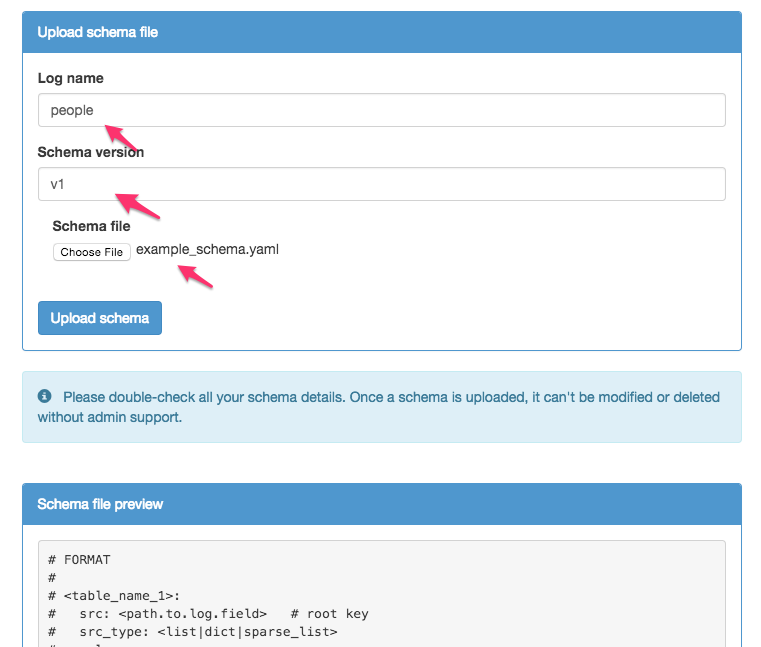

**Deprecation Notice**

Mycroft is now archived, but we're glad you're checking out Yelp Engineering's work on GitHub! If you'd like to learn more about what we're
up to now, please visit our [tech blog](https://engineeringblog.yelp.com/) to get the latest scoop on Yelp Engineering.

# Mycroft

Mycroft is an orchestrator that coordinates MRJob, S3, and Redshift to automatically perform light transformations on daily log data.  Just specify a cluster, schema version, s3 path, and start date, and Mycroft will watch S3 for new data, transforming and loading data without user action.  More specifically Mycroft will take json data stored in S3 and map it to a format that can be copied into Redshift using a schema you define.  The results of that map are stored back into S3, then loaded into Redshift.  Mycroft's web interface can be used to monitor the progress of in-flight data loading jobs, and to pause, resume, cancel or delete existing jobs.  Mycroft will notify via email when new data is successfully loaded or if any issues arise.  It also provides tools to automatically generate schemas from log data, and even manages the expiration of old data as well as vacuuming and analyzing data.

## Mycroft architecture

Mycroft is comprised of three services: an API, worker and scanner. The API is used to add jobs, control them and track their progress.  The worker is used to run jobs, and the scanner is used to monitor the tables Mycroft uses to store the job metadata, and insert jobs into an SQS queue for the worker.
 
## Getting Started with Mycroft

To get up and running with Mycroft, you'll need AWS credentials that Mycroft can use and a VPC ID.  With this information, the Mycroft creation script will provision all the AWS services that Mycroft needs to operate.  The following AWS services are used:

* S3 to store the transformed data, and the schemas you define for the transformation
* Redshift to store the final results
* DynamoDB to store the job metadata
* SQS to queue jobs for the worker
* EC2 to kick off the transformations
* EMR to do the transformations
* IAM to create the EMR role, EMREC2 role and the MycroftEMREC2 instance profile

Docker should be installed, and running `docker ps` should complete successfully before proceeding.

### Clone the Mycroft Repository

This guide assumes that you've cloned the Mycroft repository and that you're in the root source directory.  To do that, execute:

```
$ git clone git@github.com:Yelp/mycroft.git
$ cd mycroft
```

### Prepare AWS

#### AWS User Setup

You'll need to have AWS credentials to use Mycroft.  We suggest adding an IAM user specifically for Mycroft.  To do this, from the Users pane of the Identity and Access Managerment (IAM) dashboard in the AWS Console, click Create New Users:


Add a `mycroft` user, leaving the "Generate an access key for each user" box checked, then click "Create":


Click on "Show User Security Credentials".  You'll need to record the access key id and secret access key.  First, copy the `aws_creds` example file from the `mycroft_config` directory to the mycroft project directory.

```
$ cp mycroft_config/aws_creds.example.yaml aws_creds.yaml
```

Replace the `ACCESS_KEY_ID` and `SECRET_ACCESS_KEY` in `aws_creds.yaml` with the information displayed in the AWS Console:


Close that, then click the `mycroft` user to edit it:


Next, add an inline policy to the Mycroft user:


Select to add a custom policy:


Add a mycroft policy, with the contents of https://gist.github.com/jcnnghm/d5989ed0905f92a858a9. This will give the `mycroft` user full access to ec2, redshift, sqs, elasticmapreduce, s3, dynamodb, cloudformation, and iam.  Hit "Apply Policy" to activate the user:


#### Retrieve VPC ID

You'll need a VPC ID to run the Mycroft creation script.  All AWS accounts created since 2013-12-04 are automatically created with a VPC.  For more information on creating VPCs and default VPCs, see http://docs.aws.amazon.com/AmazonVPC/latest/UserGuide/default-vpc.html.

A VPC ID can be retrieved from the VPC dashboard in the AWS Console:


**Note: The VPC-ID must be from the region Mycroft will be installed in.  We recommend us-west-2 (Oregon) because of S3 eventual consistency issues.  For more information about eventual consistency see http://shlomoswidler.com/2009/12/read-after-write-consistency-in-amazon.html.**

#### Run the Create Mycroft Command

Mycroft can be created using the `create_mycroft.py` (see below) script in the root of the Mycroft repository.

[boto](https://github.com/boto/boto) and [docker-compose](https://docs.docker.com/compose/) are required to run the create mycroft script.  Either `pip install boto docker-compose` or `pip install -r requirements.txt` to match the dependencies for the create script.

**WARNING: By default Mycroft will provision a single node dw2.large cluster on AWS, which at the time of this writing costs $0.25/hour.  In addition, Mycroft will store data in an S3 bucket that it provisions, and will provision 2 m3.xlarge core nodes and 1 m1.small master node on demand to process transformations.**

The create_mycroft script can be run as follows, substituting the **VPC_ID** retrieved earlier, and plugging in what you want the user and password to be for the master user for the cluster Redshift will start as **REDSHIFT_USERNAME**, and **REDSHIFT_PASSWORD** below.

Redshift master user passwords:

* must be between 8 and 64 character
* must contain at least one uppercase letter
* must contain at least one lowercase letter
* must contain one number
* can be any printable ASCII character except single quote, double quote, backslash, forward slash, @ or space

You will also need a **MAIL_USERNAME** and **MAIL_PASSWORD** from which mycroft will send status e-mails.  By default mycroft uses smtp.gmail.com as the host, port 587, and TLS security.  If you use gmail you will need to set change your account settings to [allow less secure apps to use your account](https://support.google.com/accounts/answer/6010255?hl=en).

```
python create_mycroft.py \
    --aws-creds-file=aws_creds.yaml \
    --redshift-master-user=REDSHIFT_USERNAME \
    --redshift-master-user-password=REDSHIFT_PASSWORD \
    --region-name=us-west-2 \
    --vpc-id=VPC_ID \
    --smtp-login=MAIL_USERNAME \
    --smtp-password=MAIL_PASSWORD
```

If you choose to use a different e-mail host you’ll also need to specify:

```
    --smtp-host=HOST.NAME.HERE \
    --smtp-port=PORT \
    --smtp-security=TLS_OR_SSL
```

The script will take a few minutes to run.  When the redshift cluster is created, you should see a message like:

```
Mycroft has been successfully built and configured.

Redshift Cluster Information:
    host: "HOST"
    port: "PORT"

To remove the cloud formation resources that Mycroft has
provisioned on AWS, rerun this command with the
--delete-cf-stack option.

To start using Mycroft now, just run `docker-compose up` and
point your browser at port 11476 of your docker host.
```

Be sure to note the cluster host and port, as you'll need those to connect to the Redshift cluster that Mycroft has provisioned.

If you’re stack create fails you will need to go to the cloud formation service in your AWS console, select the mycroft cloud formation stack, and click on the events tab.  You will get more details there of what failed and why -- for example creation of the redshift cluster can fail due to an invalid master user password.  Once you understand and can resolve the issue, delete the cloudformation stack and retry the `create_mycroft.py` script above.

**Note: It can take up to an hour for the bucket to fully propagate after being created.  Mycroft can be used immediately, but there will likely be S3 errors preventing log transformations from completing successfully until that propagation finishes.  Mycroft will automatically retry these jobs.**

### Using Mycroft

To use Mycroft, you'll need to run the Mycroft service, upload data to process to S3, generate a schema for that data, then start a job with Mycroft.

#### Running Mycroft

Mycroft can be started by running a single command.

```
docker-compose up
```

Once the containers start, Mycroft will be accessible on port 11476 of the docker host.

```
http://DOCKER_HOST:11476
```

#### Upload Data

Mycroft expects data to exist on S3, grouped by directory, separated by date. In addition, Mycroft expects an empty file named `COMPLETE` to be added to each directory once all the data for that day is available. The `COMPLETE` file indicates to Mycroft that data writing is finished for the day. The expected path format is:

```
s3://BUCKET/path/to/data/YYYY/MM/DD/
```

Concretely, there is some example data in the examples folder of the Mycroft root directory.  To load this data into Redshift, create a data bucket and upload this data to s3. 

```
>>> aws s3 mb s3://mycroft-quickstart-test-data
>>> aws s3 cp examples/example_data.json s3://mycroft-quickstart-test-data/people_data/2015/04/16/
>>> aws s3 cp examples/COMPLETE s3://mycroft-quickstart-test-data/people_data/2015/04/16/
```

**Note: Bucket names in S3 are global.  Replace mycroft-quickstart-test-data with a name that makes sense for your data.  The bucket must be in the same region as Mycroft.**

```
>>> aws s3 ls s3://mycroft-quickstart-test-data/people_data/2015/04/16/
2015-04-20 11:20:07          0 COMPLETE
2015-04-20 11:19:43        155 example_data.json
```

#### Generate a Schema

Mycroft provides a tool that can be used to generate example schema.  Help for it is available by running:

```
docker run -i mycroft python -m sherlock.tools.log2schema --help
```

The tool expects log data to be piped in, and will output the resulting schema on standard out.

```
cat examples/example_data.json | docker run -i mycroft python -m sherlock.tools.log2schema
```

An example schema has already been generated for the example data in `examples/example_schema.yaml`.

To add a schema to Mycroft, select the "Upload schema" task from the "Schemas" menu:


Select the schema to upload and give it a name and version number, then upload the schema:



#### Start a Job

To start the data loading job, fill out the form on the Jobs > New job page.  The Redshift cluster "Mycroft" was created automatically during setup. Mycroft will wait until the following day before attempting to load data, so for immediate loading, use a date at least two days in the past.


**Note: The S3 path should end with a trailing slash.**

Detailed job status can be retrieved by clicking on status on the "Jobs > View jobs" page.

Mycroft will provision an EMR cluster then load data into Redshift.  Once the load is successfully completed, the job details will turn green for that date:


